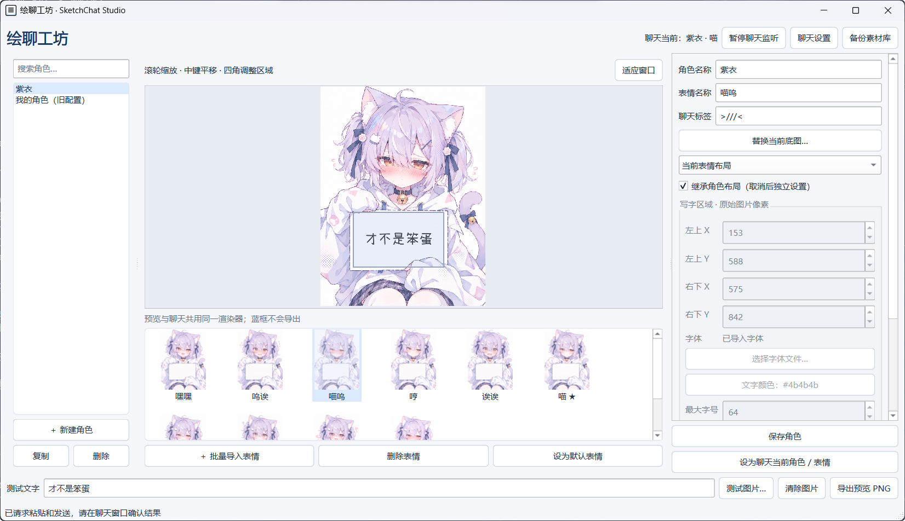

# 绘聊工坊 · SketchChat Studio

**把一句话，放进角色的画板里。**

一款 Windows 本地图片聊天工具：管理角色与表情，在底图上可视化设置写字区域，通过快捷键把聊天输入转换成图片，按需粘贴或发送到 QQ、微信等应用。



*自定义角色与表情的实际界面示例。截图中的角色素材不代表软件附赠内容，素材授权需另行确认。*

## 功能亮点

- **多角色、多表情**：批量导入底图，管理默认表情与自定义聊天标签。
- **可视化编辑**：拖拽框选区域，调整字体、颜色、对齐和遮挡层，实时预览并导出 PNG。
- **布局继承**：角色共用默认布局，特殊构图的表情可独立设置。
- **快捷键录制**：直接按键设置生成、发送和表情切换快捷键，支持冲突检查。
- **表情跟随可选**：延续上一次表情，或只使用一次后恢复默认。
- **托盘与本地素材库**：一键启停监听，素材自动复制，支持备份与删除恢复。

编辑草稿与聊天状态分离：**浏览和预览不会悄悄切换聊天底图。**

## 安装与启动

**系统要求：Windows 10/11、Python 3.10+。** Python 需自行安装，建议启用 Python Launcher 或添加到 PATH。

1. 下载本仓库的 **Code → Download ZIP** 并解压，或使用 Git：
   ```powershell
   git clone https://github.com/WisteriaZy/SketchChat-Studio.git
   ```
2. 双击项目目录中的 **`StartStudio.exe`**。
3. 首次运行若缺少环境或依赖，点击 **“确认安装 / 修复”**。向导会创建项目 `.venv`、安装依赖并显示进度；环境已就绪时仅离线检查，不重复联网安装。

> **EXE 是启动器，不是独立安装包。** 请保留完整项目，不能只复制 EXE。初始化可能下载数百 MB；不会自动安装系统 Python、修改 PATH 或删除已有虚拟环境。失败详情见 `library/setup.log`。

<details>
<summary>手动安装与启动</summary>

在项目根目录打开 PowerShell：

```powershell
python -m venv .venv
.\.venv\Scripts\python.exe -m pip install -r requirements.txt
.\.venv\Scripts\python.exe desktop.py
```

日常使用 EXE 无终端启动；终端启动便于排查错误。启动器构建方式见 [开发说明](docs/DEVELOPMENT.md)。

</details>

## 基本用法

1. **导入角色和表情**，在右侧“角色默认布局”中框出写字区域并选择字体。
2. 个别表情构图不同时，取消“继承角色布局”并单独调整。这里继承的是**当前角色的默认布局**，不是默认表情。
3. 输入测试文字检查效果，**保存角色**，再点击“设为聊天当前角色 / 表情”。
4. 打开“聊天设置”，录制生成快捷键（如 `F8`），确认允许的聊天进程。建议先关闭自动发送。
5. **启用监听**，在自己的聊天输入框中输入文字，按下并松开生成键，检查生成与粘贴结果。

### 用标签切换表情

将某个表情的“聊天标签”设为 `/开心`，输入：

```text
/开心 今天真不错！
```

程序使用对应底图，只把“今天真不错！”绘制进去。

- 支持 `#开心#`、`[开心]`、`:)` 等自定义格式，**仅匹配消息最开头**，不跨角色查找。
- 关闭“跟随上一次表情”后，标签只影响本条；表情快捷键或单独输入标签只影响下一条，生成后恢复角色默认表情。
- 默认不读取剪贴板图片；需要配图时，在设置中明确开启“使用剪贴板图片作为配图”。

### 托盘操作

**绿色勾号表示监听中，灰色暂停符号表示已暂停。** 左键单击切换监听，右键菜单打开管理器或退出。

每次启动、打开设置时都会暂停监听。关闭窗口只是隐藏到托盘；更新程序后请从托盘退出再重启。

## 使用前请注意

- 聊天操作通过**键盘与剪贴板自动化**完成，并非 QQ/微信官方接口。输入法、窗口焦点、权限和客户端响应可能影响结果；建议先在自己的聊天中关闭自动发送测试。
- Enter 容易与输入法冲突，可换为 `F8` 等未占用的键。左右 Ctrl/Alt 在部分键盘布局下可能无法独立绑定。
- 不要同时运行旧版 `Start.cmd` / `main.py` 与桌面版监听。
- 角色库位于 `library/`，可在界面中备份。首次运行会尝试迁移旧配置与素材，不覆盖原文件；换电脑时请重建虚拟环境。
- 当前不支持 macOS/Linux、倾斜透视排版、绘画抠图或多图消息解析；暂未提供独立完整安装包。

## 文档与排错

- [使用手册](docs/USER_GUIDE.md)：布局、快捷键、延迟调整、迁移和备份。
- [开发说明](docs/DEVELOPMENT.md)：目录结构、测试、启动器构建和发布检查。
- 日志：`library/setup.log`（初始化）、`library/launcher.log`（启动）、`library/studio.log`（运行）。
- [反馈问题](https://github.com/WisteriaZy/SketchChat-Studio/issues)：请附复现步骤、系统及聊天客户端版本；分享日志前先检查个人信息。

## 致谢与许可

本项目基于 [MarkCup-Official/Anan-s-Sketchbook-Chat-Box](https://github.com/MarkCup-Official/Anan-s-Sketchbook-Chat-Box) 演进，感谢原项目及贡献者。

代码沿用 [MIT License](LICENSE)，保留原版权声明。**代码许可不涵盖角色图片、游戏素材及字体的分发授权**，使用与分享素材时请确认作者授权及相关二创规范。
